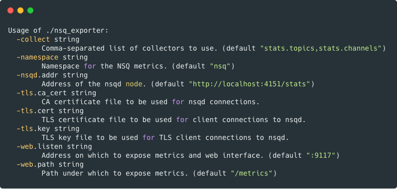

# NSQ Exporter

NSQ exporter for prometheus.io, written in go.  
the orginal repo is [lovoo/nsq_exporter](https://github.com/lovoo/nsq_exporter)
ps: this repo is just for personal usage. 

## Usage
### Without Docker  

### With Docker 
> `docker run -d --name nsq_exporter  -p 9117:9117 <docker-images> -nsqd.addr=http://nsqd:4151 -collect=stats.topics,stats.channels,stats.clients`

## Build
> `make build`  
 will build the binary into `build/` folder  

## Exported Metrics
### `stats.channels` exposes following metrics
| metrics                     | type  | lables               | description                     | example                                                                           |
|-----------------------------|-------|----------------------|---------------------------------|-----------------------------------------------------------------------------------|
| nsq_channel_backend_depth   | gauge | topic,channel,paused | Queue backend depth             | nsq_channel_backend_depth{channel="bind",paused="false",topic="bind_teacher"} 0   |
| nsq_channel_client_count    | gauge | topic,channel,paused | Number of clients               | nsq_channel_client_count{channel="bind",paused="false",topic="bind_teacher"} 1    |
| nsq_channel_deferred_count  | gauge | topic,channel,paused | Count of deferred messages      | nsq_channel_deferred_count{channel="bind",paused="false",topic="bind_teacher"} 0  |
| nsq_channel_depth           | gauge | topic,channel,paused | Queue depth                     | nsq_channel_depth{channel="bind",paused="false",topic="bind_teacher"} 0           |
| nsq_channel_e2e_latency_95p | gauge | topic,channel,paused | 95th percentile for e2e latency | nsq_channel_e2e_latency_95p{channel="bind",paused="false",topic="bind_teacher"} 0 |
| nsq_channel_e2e_latency_99p | gauge | topic,channel,paused | 99th percentile for e2e latency | nsq_channel_e2e_latency_99p{channel="bind",paused="false",topic="bind_teacher"} 0 |
| nsq_channel_in_flight_count | gauge | topic,channel,paused | Count of in flight message      | nsq_channel_in_flight_count{channel="bind",paused="false",topic="bind_teacher"} 0 |
| nsq_channel_message_count   | gauge | topic,channel,paused | Count of queued message ever    | nsq_channel_message_count{channel="bind",paused="false",topic="bind_teacher"} 50  |
| nsq_channel_requeue_count   | gauge | topic,channel,paused | Count of requeued message ever  | nsq_channel_requeue_count{channel="bind",paused="false",topic="bind_teacher"} 16  |
| nsq_channel_timeout_count   | gauge | topic,channel,paused | Count of timeout event ever     | nsq_channel_timeout_count{channel="bind",paused="false",topic="bind_teacher"} 3   |

### `stats.clients` exposes following metrics(not very useful, expose too many metrics)
| metrics                    | type  | lables                                                                     | description                                                                                                                 | example                                                                                                                                                                                                                                                              |
|----------------------------|-------|----------------------------------------------------------------------------|-----------------------------------------------------------------------------------------------------------------------------|----------------------------------------------------------------------------------------------------------------------------------------------------------------------------------------------------------------------------------------------------------------------|
| nsq_client_connect_ts      | gauge | topic,channel,deflate,snappy,tls,client_id,hostname,version,remote_address | Connect timestamp for each client                                                                                           | nsq_client_connect_ts{channel="bind",client_id="118.190.216.176",deflate="false",hostname="118.190.216.176",instance="47.104.187.154:9117",job="nsq",remote_address="118.190.216.176:24067",snappy="false",tls="false",topic="bind_teacher",version="V2"} 1558058092 |
| nsq_client_state           | gauge | topic,channel,deflate,snappy,tls,client_id,hostname,version,remote_address | State of client Possible value: const ( stateInit = iota, stateDisconnected, stateConnected, stateSubscribed, stateClosing) | nsq_client_state{channel="bind",client_id="118.190.216.176",deflate="false",hostname="118.190.216.176",instance="47.104.187.154:9117",job="nsq",remote_address="118.190.216.176:24067",snappy="false",tls="false",topic="bind_teacher",version="V2"} 3               |
| nsq_client_finish_count    | gauge | topic,channel,deflate,snappy,tls,client_id,hostname,version,remote_address | Finish count                                                                                                                | nsq_client_finish_count{channel="bind",client_id="118.190.216.176",deflate="false",hostname="118.190.216.176",instance="47.104.187.154:9117",job="nsq",remote_address="118.190.216.176:24067",snappy="false",tls="false",topic="bind_teacher",version="V2"} 7        |
| nsq_client_in_flight_count | gauge | topic,channel,deflate,snappy,tls,client_id,hostname,version,remote_address | In flight count                                                                                                             | nsq_client_in_flight_count{channel="bind",client_id="118.190.216.176",deflate="false",hostname="118.190.216.176",remote_address="118.190.216.176:24067",snappy="false",tls="false",topic="bind_teacher",version="V2"} 0                                              |
| nsq_client_message_count   | gauge | topic,channel,deflate,snappy,tls,client_id,hostname,version,remote_address | Queue message count                                                                                                         | nsq_client_message_count{channel="bind",client_id="118.190.216.176",deflate="false",hostname="118.190.216.176",remote_address="118.190.216.176:24067",snappy="false",tls="false",topic="bind_teacher",version="V2"} 5                                                |
| nsq_client_ready_count     | gauge | topic,channel,deflate,snappy,tls,client_id,hostname,version,remote_address | Ready count                                                                                                                 | nsq_client_ready_count{channel="bind",client_id="118.190.216.176",deflate="false",hostname="118.190.216.176",remote_address="118.190.216.176:24067",snappy="false",tls="false",topic="bind_teacher",version="V2"} 1                                                  |
| nsq_client_requeue_count   | gauge | topic,channel,deflate,snappy,tls,client_id,hostname,version,remote_address | Requeue count                                                                                                               | nsq_client_requeue_count{channel="bind",client_id="118.190.216.176",deflate="false",hostname="118.190.216.176",remote_address="118.190.216.176:24067",snappy="false",tls="false",topic="bind_teacher",version="V2"} 0                                                |
| nsq_client_sample_rate     | gauge | topic,channel,deflate,snappy,tls,client_id,hostname,version,remote_address | Sample Rate                                                                                                                 | nsq_client_sample_rate{channel="bind",client_id="118.190.216.176",deflate="false",hostname="118.190.216.176",remote_address="118.190.216.176:24067",snappy="false",tls="false",topic="bind_teacher",version="V2"} 0                                                  |
### `stats.topics` expose` following metrics
| metrics                             | type  | lables       | description                       | example                                                             |
|-------------------------------------|-------|--------------|-----------------------------------|---------------------------------------------------------------------|
| nsq_topic_backend_depth             | gauge | topic,paused | Queue backend depth               | nsq_topic_backend_depth{paused="false",topic="login"} 0             |
| nsq_topic_channel_count             | gauge | topic,paused | Number of channels                | nsq_topic_channel_count{paused="false",topic="login"} 1             |
| nsq_topic_depth                     | gauge | topic,paused | Queue depth                       | nsq_topic_depth{paused="false",topic="login"} 0                     |
| nsq_topic_e2e_latency_95_percentile | gauge | topic,paused | Queue e2e latency 95th percentile | nsq_topic_e2e_latency_95_percentile{paused="false",topic="login"} 0 |
| nsq_topic_e2e_latency_99_percentile | gauge | topic,paused | Queue e2e latency 99th percentile | nsq_topic_e2e_latency_99_percentile{paused="false",topic="login"} 0 |
| nsq_topic_message_count             | gauge | topic,paused | Queue message count               | nsq_topic_message_count{paused="false",topic="login"} 586           |
